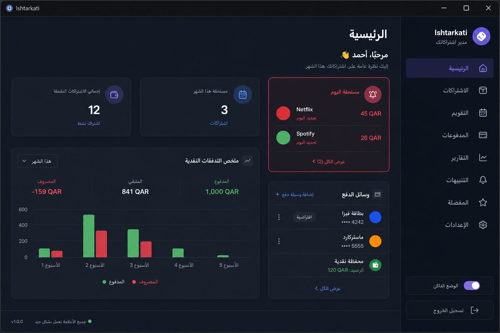
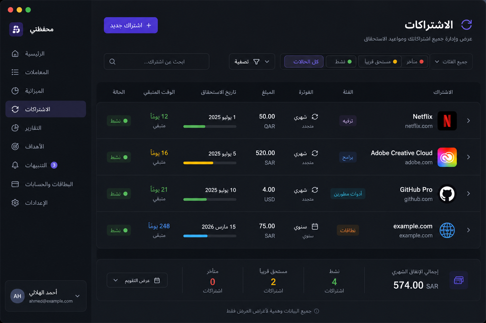

<p align="center">
  
</p>

<h1 align="center">Ishtarkati</h1>

<p align="center">
  <strong>Arabic-first desktop app to track subscriptions, renewals, and online accounts.</strong><br>
  Local-only · Encrypted-friendly backups · No cloud account required
</p>

<p align="center">
  <a href="https://github.com/balnaimi/Ishtarkati/releases/latest">
    
  </a>
</p>

---

## Download

**Desktop only** — not for phones or tablets. Pick your platform (links always point to the **latest release**):

<p align="center">
  <a href="https://github.com/balnaimi/Ishtarkati/releases/latest/download/Ishtarkati-linux.AppImage" title="Linux AppImage">
    <br>
    <strong>Linux</strong><br>
    <sub>AppImage</sub>
  </a>
  &nbsp;&nbsp;&nbsp;&nbsp;
  <a href="https://github.com/balnaimi/Ishtarkati/releases/latest/download/Ishtarkati-win-x64-setup.exe" title="Windows 64-bit installer">
    <br>
    <strong>Windows</strong><br>
    <sub>x64 installer</sub>
  </a>
  &nbsp;&nbsp;&nbsp;&nbsp;
  <a href="https://github.com/balnaimi/Ishtarkati/releases/latest/download/Ishtarkati-mac-arm64.dmg" title="macOS Apple Silicon">
    <br>
    <strong>macOS</strong><br>
    <sub>Apple Silicon (M1+)</sub>
  </a>
</p>

| Platform | File | Notes |
|----------|------|--------|
| **Linux** | `Ishtarkati-linux.AppImage` | Most distros; make executable (`chmod +x`) then run. No `.deb` / Flatpak. |
| **Windows** | `Ishtarkati-win-x64-setup.exe` | **64-bit only** (x64). |
| **macOS** | `Ishtarkati-mac-arm64.dmg` | **Apple Silicon only** (M1/M2/M3…). Intel Macs are not supported. |

If a download fails, open the full [Releases](https://github.com/balnaimi/Ishtarkati/releases/latest) page.

**Linux tip:** if an older AppImage reports FUSE/`libfuse` errors, run:

```bash
APPIMAGE_EXTRACT_AND_RUN=1 ./Ishtarkati-linux.AppImage
```

Unsigned Windows/macOS builds may show SmartScreen or Gatekeeper warnings until code signing is configured.

---

## Screenshots

_Demo data — not real accounts._

<p align="center">
  
</p>

<p align="center">
  <em>Home — overview, due today, cashflow, and payment methods</em>
</p>

<p align="center">
  
</p>

<p align="center">
  <em>Accounts — recurring and one-time subscriptions with search and filters</em>
</p>

---

## Why Ishtarkati?

- **Built for Arabic** — RTL UI, Tajawal font, full **English** interface option
- **Everything in one place** — paid subscriptions, free accounts, domains, trials
- **Multi-currency** — track original amounts with optional primary-currency estimates
- **Due dates & reminders** — see what is due today, soon, or overdue
- **Payment methods** — cards, wallets, and linked services per subscription
- **Insights** — calendar and spending views from your real payment history
- **Backup & restore** — export/import JSON snapshots; optional scheduled auto-backup
- **Privacy** — SQLite database stays on **your** machine; no vendor backend

---

## Quick start

1. Download and install for your OS (table above).
2. Complete the short **onboarding** wizard (language, currency, optional PIN).
3. Add accounts from **Add** or the command palette (`Ctrl+K`).
4. Mark payments when due; use **Settings** for backups, budget, and reminders.

### Where is my data?

Your database (`ishtarkati.db`) lives in the Electron **user data** folder for your OS user — not beside the AppImage or installer. Copying the app to another PC **does not** move your data unless you export a backup or copy that file manually.

---

## System requirements

| | Minimum |
|---|---------|
| **Linux** | x86_64, glibc-based distro; FUSE optional on recent AppImages |
| **Windows** | Windows 10/11 **64-bit** |
| **macOS** | macOS 12+ on **Apple Silicon** (arm64) |
| **RAM** | 4 GB recommended |
| **Network** | Optional (FX rates, update check only) |

---

## For developers

Requires **Node.js 24** (see `.nvmrc`).

```bash
git clone https://github.com/balnaimi/Ishtarkati.git
cd Ishtarkati
npm install
npm run dev          # Vite + Electron
npm test             # unit tests
npm run build:pack   # local Linux AppImage (no version bump)
```

Release pipeline (maintainers):

```bash
npm run build:release   # bump version, build, push tag → GitHub Actions builds all platforms
```

See [`CHANGELOG.md`](CHANGELOG.md) and [`release-notes/`](release-notes/) for version history.

**Commit messages** must be English only. Enable hooks: `git config core.hooksPath .githooks`

---

<p align="center">
  <sub>Ishtarkati · إشتراكاتي — stay on top of what you pay for</sub>
</p>
